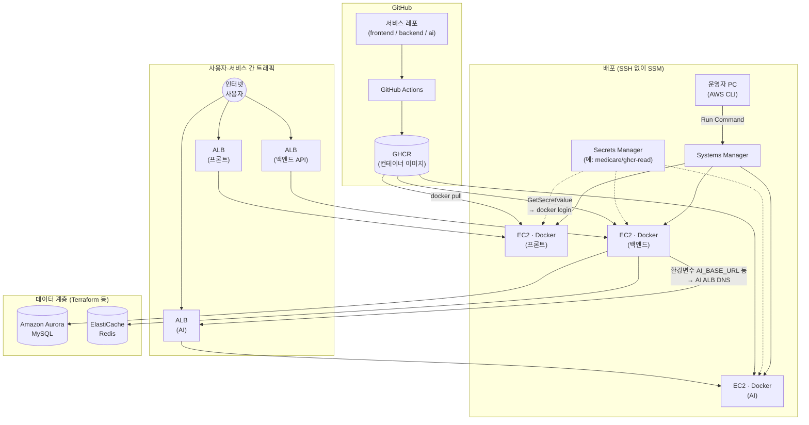

# 인프라·배포 정리

이 문서는 **지금까지 실제로 진행한 배포 방식**을 한곳에 모은 요약입니다. **EKS와 Argo CD는 추후 도입**으로 두었고, 운영 트래픽은 **EC2에서 Docker로 서비스를 띄우고 ALB로 노출**하는 구성을 전제로 합니다.

---

## 아키텍처 개요

아래는 **빌드·이미지 저장소**, **운영자가 SSM으로 배포하는 경로**, **사용자 트래픽과 백엔드가 AI를 부르는 경로**를 한 그림에 묶은 것입니다. 실제 계정에서는 프론트·백엔드·AI가 **ALB를 서비스별로 나누어** 두는 경우가 많고, EC2도 **인스턴스를 나누거나** 한 대에 여러 컨테이너를 둘 수 있습니다.



---

## GitHub Actions 워크플로 (GHCR 이미지 푸시)

아키텍처 그림의 **「레포 → GitHub Actions → GHCR」** 구간은, 각 **애플리케이션 레포** 안의 워크플로로 구현되어 있습니다. 인프라 레포(`medical-service-infra`)가 아니라 **백엔드·프론트·AI 레포**를 열어야 합니다.

### 워크플로 파일

| 서비스 | 레포(예시) | 파일 경로 |
| --- | --- | --- |
| 백엔드 | `medical-service-backend` | `.github/workflows/medical-services-ci.yml` |
| 프론트 | `medical-service-frontend` | `.github/workflows/medical-services-ci.yml` |
| AI | `ai-medicare` | `.github/workflows/medical-services-ci.yml` |

프론트 레포에는 용도별로 **다른 워크플로 YAML**이 더 있을 수 있습니다. GHCR 푸시가 목적이면 **`Push image to GHCR` job(`cd`)** 이 있는 파일을 기준으로 보면 됩니다.

### 트리거·분기

- **백엔드**: `push` / `pull_request`는 주로 **`main`** 대상. **이미지 푸시(`cd`)** 는 `push` 이면서 브랜치가 **`main`** 일 때만 실행됩니다.
- **프론트·AI**: `main` / `master` / `develop` 등 레포 설정에 따라 CI가 돌고, **`cd`는 `push` + (`main` 또는 `master`)** 인 경우에만 실행되는 식으로 제한되어 있습니다(각 YAML의 `if:` 확인).

### 잡 구조 (공통 패턴)

1. **`ci`**: 소스 체크아웃 → 언어별 빌드·테스트(Gradle / npm·Next / Python 등) → **Docker 이미지는 `push: false` 로 스모크 빌드만** 수행하는 단계가 포함됩니다.
2. **`cd`** (`needs: ci`): **`ci` 성공 후**에만 실행. `docker/login-action`으로 **`ghcr.io`** 에 로그인(`GITHUB_TOKEN`, `packages: write` 권한) → **`docker/build-push-action`으로 `push: true`** 하여 레지스트리에 올립니다.

### GHCR에 찍히는 태그

- 이미지 이름: **`ghcr.io/<소문자 owner>/<소문자 repo>`** (워크플로에서 `github.repository`를 소문자로 변환).
- 태그: **`:latest`** 와 **`:<github.sha>`** (커밋 SHA)를 함께 푸시하는 구성입니다.

운영에서 SSM으로 넘기는 `-GhcrImage` 는 보통 **`...:latest`** 를 쓰고, 롤백·재현이 필요하면 같은 SHA 태그를 지정할 수 있습니다.

### PR과 `main` 푸시의 차이

- **Pull request**: 대개 **`ci`만** 돌고, GHCR로는 **푸시하지 않습니다**(`cd` 조건이 `push` 전용).
- **`main`(또는 조건에 맞는 브랜치)에 push**: `ci` 통과 후 **`cd`가 GHCR에 push** 합니다.

이후 단계는 이 문서 **「3. 배포 절차」** 에서처럼, GHCR에 올라온 이미지를 **SSM + EC2** 에서 `docker pull` 하면 됩니다.

---

## 1. 결정 사항

| 항목 | 내용 |
| --- | --- |
| 앱 이미지 | 각 서비스 레포의 **GitHub Actions**가 빌드 후 **GitHub Container Registry(`ghcr.io/...`)** 에 푸시 |
| 런타임 | **Amazon EC2** + **Docker** |
| 트래픽 진입 | **Application Load Balancer** + 타깃 그룹(헬스 체크) |
| 배포 채널 | **AWS Systems Manager**(Run Command). SSH(22) 없이 **HTTPS(443)** 만으로 배포 가능 |
| 데이터 | **Amazon Aurora MySQL** 등은 Terraform 등으로 구성. **Redis** 는 **Amazon ElastiCache for Redis** 를 **AWS CLI**로 생성(서브넷 그룹·보안 그룹·클러스터/복제 그룹)하고, 엔드포인트를 백엔드 `medical-backend.env` 의 Redis 호스트·포트에 반영 |
| GitOps | **Argo CD + EKS** 는 레포에 자료만 두고 **추후** 진행 |

---

## 1-1. ElastiCache for Redis (AWS CLI로 구성)

Redis는 **RDS(Aurora)와 달리 Terraform이 아니라 AWS CLI**로 리소스를 만들고, 생성된 **기본 엔드포인트(Primary endpoint)** 를 백엔드 환경 변수(예: `REDIS_HOST`, `REDIS_PORT`)에 넣는 방식으로 맞췄습니다. 아래는 **일반적인 순서**이며, 실제로 쓴 **VPC·서브넷·보안 그룹 ID·이름**은 계정에 맞게 바꿉니다. 리전은 다른 절차와 같이 예를 들어 **`ap-northeast-2`** 로 통일합니다.

### 왜 CLI인지

- VPC·RDS 등은 Terraform으로 잡아 두고, Redis만 **콘솔/CLI로 빠르게** 올리거나, 팀에서 **CLI 스크립트로 재현**하기 쉬운 형태로 둔 경우에 해당합니다.
- ElastiCache는 **서브넷 그룹**(어느 AZ의 서브넷에 노드를 둘지)과 **보안 그룹**(누가 6379로 붙을지)이 맞아야 백엔드 EC2에서 연결됩니다.

### 절차 요약

1. **캐시 서브넷 그룹** — Redis를 올릴 **프라이빗 서브넷** ID를 2개 이상(다른 AZ) 지정하는 것이 일반적입니다.
2. **보안 그룹** — Redis 전용 SG를 만들거나 기존 SG를 쓰고, **인바운드 TCP 6379** 를 **백엔드 EC2에 붙은 보안 그룹**에서만 허용합니다(인터넷에서 직접 Redis로 오지 않게).
3. **복제 그룹(Replication group)** 또는 **단일 캐시 클러스터** — 엔진 `redis`, 노드 타입·버전·이름을 지정해 생성합니다.
4. **엔드포인트 확인** — `describe-replication-groups`(또는 `describe-cache-clusters`)로 **주소**를 확인해 `medical-backend.env` 에 반영합니다.
5. **배포** — SSM으로 백엔드 컨테이너를 다시 올려 env가 반영되게 합니다.

### 1) 캐시 서브넷 그룹 생성

```bash
aws elasticache create-cache-subnet-group \
  --region ap-northeast-2 \
  --cache-subnet-group-name medicare-redis-subnet \
  --cache-subnet-group-description "Private subnets for Redis" \
  --subnet-ids subnet-aaaaaaaa subnet-bbbbbbbb
```

이미 있다면 `describe-cache-subnet-groups` 로 이름·서브넷을 확인만 하면 됩니다.

### 2) 보안 그룹(예: Redis 전용) 및 인바운드

Redis용 SG를 새로 만들었다면, **백엔드 EC2가 사용하는 SG**(`sg-backend` 등)에서 오는 **6379** 만 허용합니다.

```bash
# 예: Redis SG 생성 (VPC는 백엔드와 동일)
aws ec2 create-security-group \
  --region ap-northeast-2 \
  --group-name medicare-redis-sg \
  --description "ElastiCache Redis" \
  --vpc-id vpc-xxxxxxxx

# 백엔드 EC2 SG -> Redis SG, 6379
aws ec2 authorize-security-group-ingress \
  --region ap-northeast-2 \
  --group-id sg-redisxxxxxxxx \
  --protocol tcp \
  --port 6379 \
  --source-group sg-backendxxxxxxxx
```

### 3) 복제 그룹 생성 예시 (Redis, 클러스터 모드 비활성화)

노드 개수·타입·버전은 비용·가용성 정책에 맞게 조정합니다. **Transit encryption** 을 켜면 애플리케이션에서 TLS 연결이 필요하므로, 처음에는 끈 구성으로 올린 뒤 필요 시 켜는 편이 단순합니다.

```bash
aws elasticache create-replication-group \
  --region ap-northeast-2 \
  --replication-group-id medicare-redis \
  --replication-group-description "Backend Redis" \
  --engine redis \
  --engine-version "7.1" \
  --cache-node-type cache.t4g.micro \
  --num-cache-clusters 2 \
  --cache-subnet-group-name medicare-redis-subnet \
  --security-group-ids sg-redisxxxxxxxx \
  --at-rest-encryption-enabled
```

`--transit-encryption-enabled` 를 켜지 않으면(기본적으로 끄거나 명시하지 않으면) 앱은 일반 TCP로 6379에 붙으면 됩니다. 전송 구간 암호화를 켠 경우에는 Spring 등에서 **TLS Redis URL** 설정이 필요합니다.

단일 노드만 필요하면 `create-cache-cluster` 로 `cache-cluster-id`, 동일한 서브넷 그룹·SG를 지정하는 방식도 가능합니다.

### 4) 엔드포인트 확인 후 env 반영

복제 그룹인 경우 **Primary endpoint** 주소를 씁니다.

```bash
aws elasticache describe-replication-groups \
  --region ap-northeast-2 \
  --replication-group-id medicare-redis \
  --query "ReplicationGroups[0].NodeGroups[0].PrimaryEndpoint.{Address:Address,Port:Port}" \
  --output table
```

나온 **Address**·**Port**(보통 `6379`)를 `medical-backend.env` 의 Redis 관련 항목에 넣고, **비밀번호(Auth token)** 를 썼다면 같은 파일·Secrets Manager 정책을 맞춥니다.

### 5) 연결 확인 시 참고

- Redis SG에 **백엔드 EC2의 SG**가 아니라 다른 대역만 열려 있으면 **타임아웃**이 납니다. RDS와 마찬가지로 **같은 VPC 안에서 SG 기준 허용**이 맞는지 다시 확인합니다.
- 생성 직후 `creating` 상태가 길 수 있으므로, `describe-replication-groups` 의 **Status** 가 `available` 이 된 뒤 백엔드를 재기동합니다.

---

## 2. 구성 요소가 하는 일

- **ALB**: 프론트(정적/Node 등 구성에 따름), 백엔드 API, AI 서비스로 각각 또는 경로 기준으로 라우팅할 수 있습니다.
- **EC2**: 서비스별(또는 역할별) 인스턴스에 Docker 컨테이너로 이미지 실행.
- **GHCR**: CI가 만든 이미지 저장소. 레지스트리가 비공개면 EC2에서 `docker login`에 쓸 자격 증명이 필요합니다.
- **Secrets Manager**: 예) 시크릿 이름 `medicare/ghcr-read` — JSON 형태 `{"username":"...","token":"..."}` 로 GHCR 로그인에 사용.
- **환경 파일**: 백엔드는 저장소 루트 근처 `medical-backend.env`, AI는 `medical-ai.env` 를 로컬에서 관리하고, SSM 스크립트가 인스턴스의 `/opt/` 등에 반영합니다. **이 파일에는 실비밀번호·토큰이 들어가므로 Git에 커밋하지 않습니다.**

백엔드는 프론트 주소(CORS), DB JDBC URL, Redis 호스트, JWT/메일 등과 함께 **AI 서비스 베이스 URL**(`AI_BASE_URL` 등)을 두어, ALB DNS 기준으로 AI 컨테이너와 통신하도록 맞춥니다.

---

## 3. 배포 절차(반복 작업)

### 3.1 사전 조건

- 로컬(또는 CI)에서 **AWS CLI**가 배포 대상 계정·리전(예: `ap-northeast-2`)으로 동작합니다.
- 대상 EC2에 **SSM Agent** 및 **AmazonSSMManagedInstanceCore** 권한이 있는 인스턴스 프로파일이 붙어 있습니다.
- 콘솔 또는 CLI로 `describe-instance-information` 했을 때 **PingStatus=Online** 입니다.
- GHCR 이미지가 푸시되어 있습니다(예: `ghcr.io/<org>/backend-medicare:latest`).

### 3.2 백엔드

1. `medical-backend.env` 를 최신 연결 정보로 수정합니다.
2. 저장소 `scripts` 디렉터리에서 예시와 같이 실행합니다.

```powershell
.\deploy-backend-ssm.ps1 `
  -Region ap-northeast-2 `
  -InstanceId i-xxxxxxxxxxxxxxxxx `
  -GhcrImage "ghcr.io/<org>/backend-medicare:latest" `
  -EnvFile "C:\path\to\medical-service-infra\medical-backend.env"
```

스크립트는 원격에서 env·이미지명을 쓰기 위해 인코딩 전달 후, `docker pull` → 기존 컨테이너 중지·제거 → `docker run` 까지 수행합니다.

### 3.3 AI 서비스

- `deploy-ai-ssm.ps1` 에 인스턴스 ID와 필요 시 `-EnvFile`, `-GhcrImage` 를 맞춥니다. 기본 env 경로는 스크립트 기준 상위의 `medical-ai.env` 입니다.

### 3.4 프론트엔드

- `deploy-frontend-ssm.ps1` 로 지정 EC2에서 `fe-ssm-bootstrap.sh` 를 실행해 GHCR에서 프론트 이미지를 받아 컨테이너를 기동합니다.

각 스크립트 상단 주석에 **선행 조건**과 **예시**가 있습니다.

---

## 4. 배포 성공 여부 확인

1. **SSM**: Run Command 결과가 **Success** 인지 확인합니다.
2. **ALB**: 해당 타깃 그룹의 타깃이 **healthy** 인지 확인합니다.
3. **HTTP**: 백엔드 ALB 주소로 `GET /health` 가 **200** 이고 본문이 기대값(예: `ok`)인지 확인합니다. 컨테이너 기동 직후에는 **502**가 잠시 나올 수 있어, 수십 초 후 재시도합니다.
4. **기능**: 프론트에서 **로그인·주요 화면**이 되면 end-to-end로는 배포가 유효한 상태로 봅니다.
5. **AI 연동**: 백엔드가 AI ALB를 프록시하는 엔드포인트를 두었다면, 해당 경로(예: `GET /api/ai/alerts`)가 **200** 인지 확인합니다.

문제 시 같은 인스턴스에서 SSM으로 `docker logs <컨테이너명>` 과 `/opt/medical-backend.env` 의 URL·DB·Redis 값을 점검합니다.

---

## 5. 레포 안의 “추후” 자료

- **`k8s/`**: EKS에서 쓸 Kustomize 베이스·오버레이.
- **`argocd/`**: Application 예시.
- **`md/DEPLOY.md`**, **`md/AFTER_EKS.md`**: EKS 생성·Argo 설치 등 단계형 가이드.

EKS/Argo로 옮길 때는 이 문서의 EC2·SSM 절차와 병행하지 말고, **타깃 환경을 하나로 정한 뒤** 전환 계획을 잡는 것이 좋습니다.

---

## 6. 보안·운영 메모

- GHCR 토큰·DB 비밀번호는 **Git에 올리지 않고** Secrets Manager 또는 안전한 채널로만 배포합니다.
- SSM 출력 로그에 **시크릿이 노출되지 않게** 터미널·이슈 공유 시 주의합니다.
- `latest` 태그는 편하지만 재현성이 떨어지므로, 안정화 단계에서는 **SHA 또는 의미 있는 버전 태그**를 검토합니다.

같은 프로젝트에서 배포하며 겪은 **이슈와 해결 요약**은 [DEPLOYMENT_ISSUES_AND_RESOLUTIONS.md](DEPLOYMENT_ISSUES_AND_RESOLUTIONS.md)를 참고합니다.
